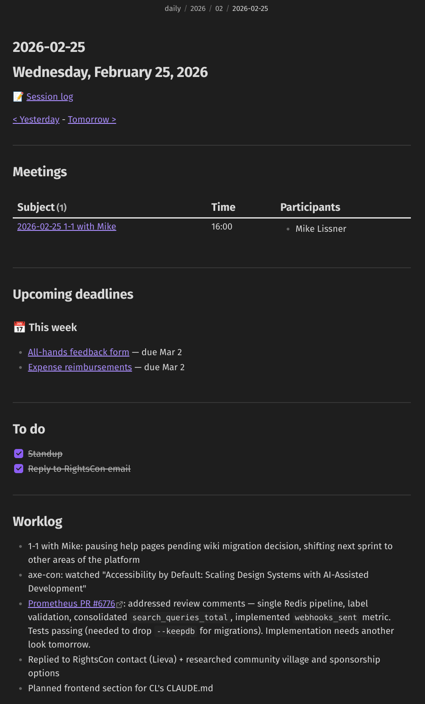
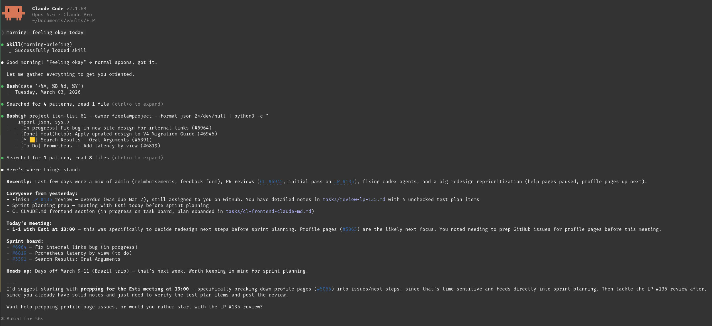

# Work Tracking with Obsidian + Claude Code

A template for tracking your daily work, built with [Obsidian](https://obsidian.md/) and [Claude Code](https://docs.anthropic.com/en/docs/claude-code). It works as an externalized working memory — a place to offload what you're doing, what you've done, and what's next, so you don't have to hold it all in your head.

## Contents

- [The problem this solves](#the-problem-this-solves)
- [How it works](#how-it-works) — daily log, routines, task board
- [What the AI does](#what-the-ai-does) — session logging, briefings, executive function support
- [What a day looks like](#what-a-day-looks-like)
- [Getting started](#getting-started)
- [What's in this repo](#whats-in-this-repo)
- [The energy tracking system](#the-energy-tracking-system)
- [Making it yours](#making-it-yours) — customization, extending plugins
- [Contributing](#contributing)
- [See it in action](#see-it-in-action) — screenshots

## The problem this solves

If you've ever finished a work day feeling like you didn't accomplish anything (even when you did), or spent the first hour of the morning trying to remember where you left off, or felt paralyzed by too many things competing for your attention — this system is for that.

It gives you:

- **Proof of work** — so you can stop second-guessing whether you were productive, and so you have receipts when you need them (standups, 1-1s, performance reviews)
- **Context continuity** — so you don't waste energy reconstructing where you left off every morning. Claude conversations end, but session logs carry context forward across conversations and across days.
- **Knowledge that compounds** — observations captured in passing become reusable later. Patterns noticed during code reviews can turn into team documentation. For example, [this commit](https://github.com/freelawproject/courtlistener/commit/5a4cd923) drew on months of session logs to produce a frontend guide that would have been impossible to write from memory alone. The system remembers what you'd otherwise forget.
- **A place for "not right now"** — so things stop crowding your head while you focus on what's in front of you
- **Help deciding what's next** — especially on days when everything feels equally urgent or equally unimportant

## How it works

The system is built on four things:

### 1. A daily log

Every work day has two files: a detailed session log, and a daily note.

The session log captures things as they happen — PRs reviewed, issues worked on, meetings, decisions. Nothing fancy, just a running list. At the end of the day, it becomes proof of work and a reference for tomorrow.

The daily note shows the day at a glance: meetings, deadlines, a todo checklist, and a summary of the work done.

### 2. A start-of-day routine

Each morning, you run through a quick check-in: what happened yesterday, what meetings are on the calendar, what's on the project board, any open threads from previous days. This gives you a snapshot without having to dig through multiple tools. It usually ends with one or two concrete suggestions for what to start with.

### 3. An end-of-day routine

Before logging off, you do a wrap-up: mark things as done, capture anything that's still in progress, note loose ends. This is what makes the next morning's check-in useful — it's only as good as the information that went in the night before.

### 4. A place for "not now" things

A simple task board with columns: Backlog, Next, In Progress, Done. When something comes up that doesn't need attention right now, it goes here instead of living in your head or getting lost in a chat thread. Meeting action items, ideas, things to follow up on — they all have a place to land.

## What the AI does

The system would work without AI. You could do all of this with just Obsidian (or any note-taking app, really), but it's hard to keep up to date. What Claude Code adds is **consistency and reduced friction**.

The AI handles the parts you'd otherwise skip or forget:

- **Session logging**: As you work, it captures what you did, what files you touched, what decisions were made, and what's still open. This runs throughout the day so context doesn't get lost between work sessions.
- **Morning check-in**: It pulls together information from yesterday's log, the task board, pending code reviews, and the project board. Instead of checking five different places, you get one summary.
- **End-of-day wrap-up**: It walks you through closing out the day — updating the log, moving tasks, capturing loose ends. The routine is the same every time, which means you actually do it.
- **Executive function support**: On hard days, it adjusts. Fewer questions, more directive suggestions, shorter responses. You track your energy level at the start of each day, and the system responds accordingly. On good days, it's more collaborative. On bad days, it just tells you what to do next.

The AI isn't the system — it's what makes the system sustainable. The real work is in the design: what gets tracked, where it goes, how it connects. That part is all human.

## What a day looks like

**Morning**: Open a conversation and say "morning briefing." Claude reads your recent logs, checks your code review queue, scans the project board, and gives you a summary. On standup days, it drafts a standup message you can edit and post. It suggests what to start with.

**During work**: As you do things — review a PR, have a meeting, make a decision — you either log it yourself or tell Claude to capture it. Session logs are timestamped entries that track what happened, what files were involved, and what's still open. If you switch to a new Claude conversation (they don't last forever), the session log carries the context forward.

**End of day**: Say "end of day." Claude gathers everything from the session log and the current conversation, updates your daily log, marks tasks as done, and asks if there's anything you want to remember for tomorrow. It offers to save everything to git.

The whole thing takes maybe 5-10 minutes of overhead per day for the routines. The session logging happens naturally as you work.

## Getting started

See **[setup.md](setup.md)** for the full installation and configuration guide.

Quick version:
1. [Create a new repo from this template](https://docs.github.com/en/repositories/creating-and-managing-repositories/creating-a-repository-from-a-template) (or clone it directly) and open it as an Obsidian vault
2. Install required plugins (Templater, Dataview, Kanban, Periodic Notes)
3. Configure the plugins (see setup.md for exact settings)
4. Copy the `skills/` directory to `~/.claude/skills/`
5. Customize `CLAUDE.md` with your details
6. Start using it: `claude` → "morning briefing"

## What's in this repo

```
CLAUDE.md               — Instructions for Claude Code (customize this)
templates/
  daily.md              — Daily note template (auto-created by Periodic Notes)
  meeting.md            — Meeting note template with recurring meeting presets
  task.md               — Task note template for the kanban board
  startup.md            — Auto-opens today's daily note on Obsidian launch
skills/
  morning-briefing/     — Morning check-in routine
  session-log/          — Timestamped work capture throughout the day
  end-of-day/           — End-of-day wrap-up routine
tasks/
  Tasks.md              — Example kanban board
examples/
  daily-note.md         — What a filled-in daily note looks like
  session-log.md        — What a filled-in session log looks like
setup.md                — Full setup and configuration guide
```

## Tools used

- **[Obsidian](https://obsidian.md/)** — Note-taking app that works with plain markdown files stored locally. No cloud dependency.
- **[Templater](https://github.com/SilentVoid13/Templater)** — Obsidian plugin for file templates. Automates creating daily logs, meeting notes, and tasks with the right structure.
- **[Dataview](https://github.com/blacksmithgu/obsidian-dataview)** — Obsidian plugin that queries your notes like a database. Powers the meetings table and deadline tracker in daily notes.
- **[Kanban](https://github.com/mgmeyers/obsidian-kanban)** — Obsidian plugin for the task board. It's just a markdown file under the hood.
- **[Periodic Notes](https://github.com/liamcain/obsidian-periodic-notes)** — Obsidian plugin for daily note creation on a schedule.
- **[Claude Code](https://docs.anthropic.com/en/docs/claude-code)** — Anthropic's CLI tool for working with Claude in the terminal. Runs the AI routines via custom skills.

## The energy tracking system

The `CLAUDE.md` file includes a "spoons" field that tracks current energy level: none, low, normal, or high. The morning briefing checks this and adjusts its behavior — on low-energy days, the AI is more directive and asks fewer questions. On high-energy days, it's more collaborative. The value gets updated at the start of each work day.

This is based on [spoon theory](https://en.wikipedia.org/wiki/Spoon_theory) — a way of thinking about limited energy as a finite daily resource. The system doesn't fix low-energy days, but it reduces the overhead of getting through them.

## Making it yours

This is a template, not a prescription — it's meant to be adapted to how you work. Here's what you can change:

- **`CLAUDE.md`**: The `[CUSTOMIZE]` placeholders are just the starting point. You can change how Claude communicates with you, what gets logged, what the morning briefing covers, how directive or collaborative it is. This file is the main lever for shaping the system's behavior.
- **Skills**: The three included routines (morning briefing, session log, end of day) can be modified or replaced entirely. You can also write new skills for workflows that repeat in your work — weekly reviews, PR checklists, sprint planning, whatever makes sense for you.
- **Templates**: Change what daily notes, meeting notes, or task notes look like. Add fields, remove sections, restructure to match how you think.
- **Vault structure**: Add folders, rename things, reorganize. The structure in this repo is one way to do it, not the only way.
- **Plugins**: The four Obsidian plugins listed in this repo are the foundation, but Obsidian has a large plugin ecosystem and adding more is straightforward. If you need calendars, charts, custom views, or integrations with other tools, there's probably a plugin for it.

A good way to figure out what to change: ask Claude. Open a conversation in the vault, describe how you work and what's not clicking, and brainstorm together. It already has context from `CLAUDE.md` and the skill definitions, so it can suggest concrete modifications rather than generic advice.

## Contributing

This is a small project that has made my life immensely easier, and I'd love for it to be useful for others as well. If you're using it (or are trying to use it) I want to hear from you!

**[Discussions](https://github.com/elisa-a-v/obsidian-claude-code-work-tracker/discussions)** is the best starting point. Use it for questions, ideas, showing how you adapted the system, or just saying what's working and what isn't. You don't need to have built anything to participate — "I tried setting this up and got stuck on X" is genuinely helpful.

**Pull requests** are welcome for improvements to templates, skills, docs, or examples. When you open one, please describe what you changed, why, and how you've been using the system — the most useful contributions come from real experience with the workflow, not from reading the repo in isolation. AI-assisted contributions are obviously fine (look at the project), but the idea behind the change should come from actually using it.

## See it in action

### Daily note in Obsidian
Meetings, deadlines, to-dos, and worklog in one place.



### Morning briefing in Claude Code
Yesterday's summary, pending reviews, and a suggestion for what to start with.


